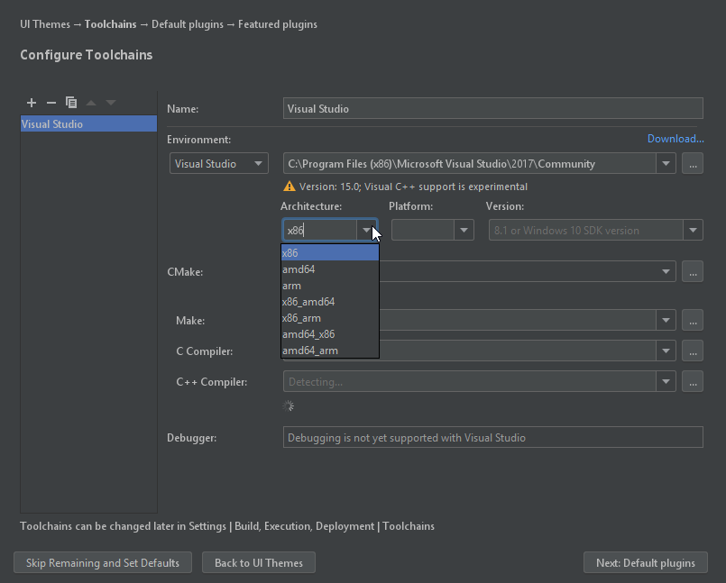
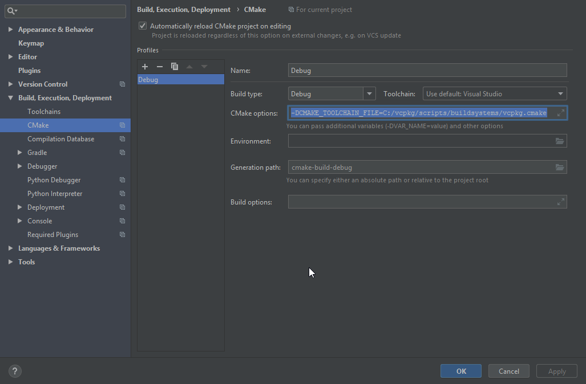

# Windows - Visual Studio / MSVC
## Toolchain
Getting started on Windows takes a bit of effort. First off, you will need a proper compiler.
The easiest way to get started, is using Visual Studio (MSVC). Run the VS2017 installer, and install the C++ environment.

## Package manager
The preferred way to get SDL installed is using a package manager.
Microsoft has recently released [vcpkg](https://github.com/Microsoft/vcpkg), which we will be using for these instructions.
Other options could be [Conan](https://conan.io/), or [Hunter](https://github.com/ruslo/hunter).

1. Install vcpkg in whatever dir you want, recommended in C:\\. PowerShell:

```powershell
PS> git clone https://github.com/Microsoft/vcpkg.git
PS> cd vcpkg
PS> .\bootstrap-vcpkg.bat
```

2. Hook up integration
```powershell
PS> .\vcpkg integrate install
```

3. Install libraries
```powershell
PS> .\vcpkg install sdl2
PS> .\vcpkg install sdl2-ttf
PS> .\vcpkg install sdl2-image
PS> .\vcpkg install sdl2-mixer
PS> .\vcpkg install box2d
PS> .\vcpkg install boost-filesystem
```

## Clion

Download [Clion](https://www.jetbrains.com/clion/download/#section=windows) from their website. If you have not already, get a free student license.

Follow the initial setup. When you have to pick a toolchain, follow these steps:

1. Under *Environment*, pick 'Visual Studio'.


2. Under *Architecture*, pick 'x86'.



3. Go to Settings (File -> Settings, or Ctrl+Alt+S). Uncollapse **Build, Execution, Deployment**. Pick *CMake*.
In the CMake options, fill in `-DCMAKE_TOOLCHAIN_FILE={ VPCKG DIR }/scripts/buildsystems/vcpkg.cmake`, or `-DCMAKE_TOOLCHAIN_FILE=C:/vcpkg/scripts/buildsystems/vcpkg.cmake` if you followed the default instructions for vcpkg.


