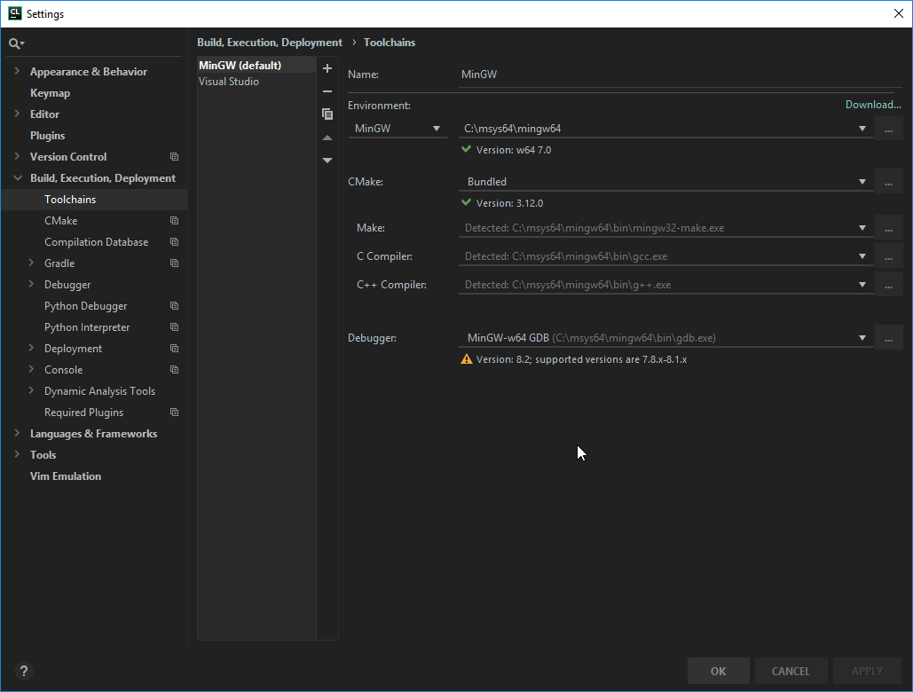

# Windows - Clion / Msys2 MingW
## Toolchain
We will use MingW/MSYS2 to build, these are ports of Unix's GCC.
Go to [MSYS's website](https://www.msys2.org/), and download the x86-64 installer and run it.

## Package manager
We will use the provided package manager with MSYS, which is Pacman. To start off, make sure you are up to date.
Start the MSYS2 terminal.

1. `pacman -Syuu`. Do this twice; the first time you will be asked to quit the terminal, do so. Then update again.
2. Install the following dependencies. If prompted to select packages, install the default (just press enter):

    `pacman -S mingw-w64-x86_64-toolchain`

    `pacman -S mingw-w64-x86_64-box2d`

    `pacman -S mingw-w64-x86_64-SDL2`

    `pacman -S mingw-w64-x86_64-SDL2_ttf`

    `pacman -S mingw-w64-x86_64-SDL2_image`

    `pacman -S mingw-w64-x86_64-SDL2_mixer`

## Clion

Download [Clion](https://www.jetbrains.com/clion/download/#section=windows) from their website. If you have not already, get a free student license.

Follow the initial setup. When you have to pick a toolchain, follow these steps:
1. If MingW/MSys2 is not detected, click the "+" sign to add a new toolchain.

2. Under *Environment*, pick 'Mingw'.

3. In the Environment path, add `C:\msys64\mingw64`

