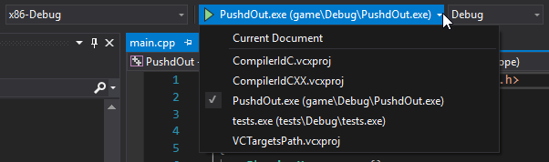

# Windows - Visual Studio / MSVC
## Toolchain
Getting started on Windows takes a bit of effort. First off, you will need a proper compiler.
The easiest way to get started, is using Visual Studio (MSVC). Run the VS2017 installer, and install the C++ environment.

Also download and install [cmake](https://cmake.org/download/).

**Visual Studio support for CMake is still well below subpar, so your your experience might not be great.**


## Package manager
The preferred way to get SDL installed is using a package manager.
Microsoft has recently released [vcpkg](https://github.com/Microsoft/vcpkg), which we will be using for these instructions.
Other options could be [Conan](https://conan.io/), or [Hunter](https://github.com/ruslo/hunter).

1. Install vcpkg in whatever dir you want, recommended in C:\\. PowerShell:

```powershell
PS> git clone https://github.com/Microsoft/vcpkg.git
PS> cd vcpkg
PS> .\bootstrap-vcpkg.bat
```

2. Hook up integration
```powershell
PS> .\vcpkg integrate install
```

3. Install SDL
```powershell
PS> .\vcpkg install sdl2
```

## Linking libraries
Visual Studio needs a configuration file to figure out the correct paths.
This project already includes a basic config file, but depending in your install paths, you may need to change it.

In the root folder, open `CMakeSettings.json` and find:
```json
"variables": [
    {
      "name": "CMAKE_TOOLCHAIN_FILE",
      "value": "C:\\vcpkg\\scripts\\buildsystems\\vcpkg.cmake"
    }
],
```
Change `value` to the proper path where vcpkg is installed.

Note: The path **ALWAYS** ends in `scripts\\buildsystems\\vcpkg.cmake`

## Building
- Open Visual Studio
- File -> Open -> CMake
- Select PushdOut as target



The game can be found in bin/PushdOut.exe.
Copy the DLL's from `C:\vcpkg\installed\x86-windows\bin` to the executable folder.
